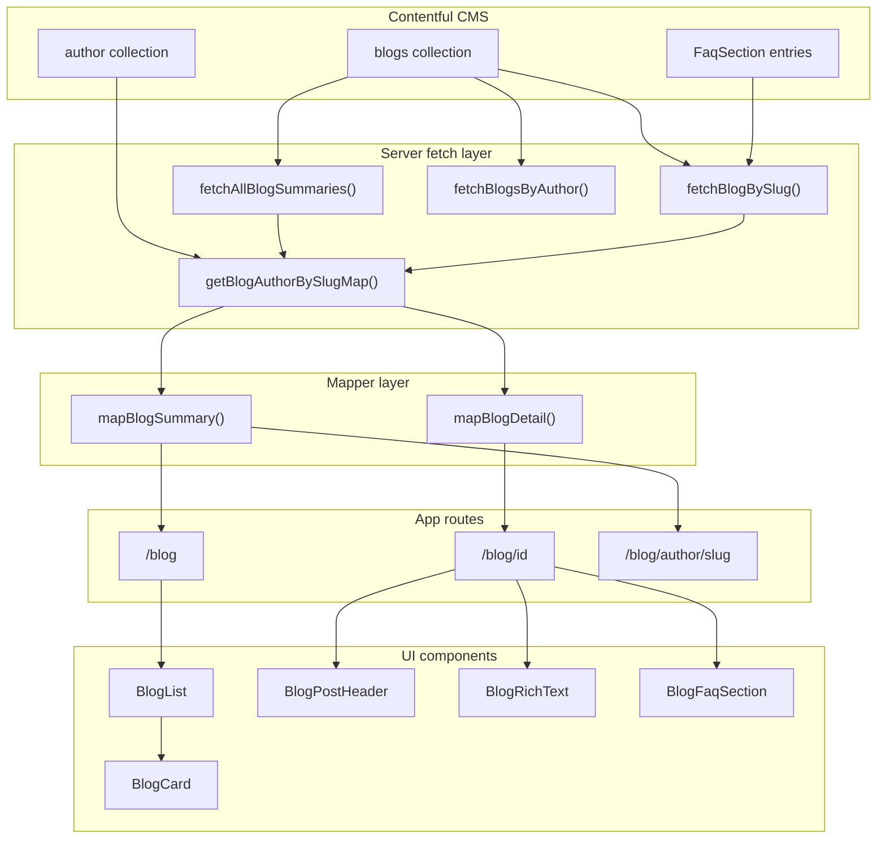

# Blog Content Architecture Report

> **Last verified:** 2026-06-22 against `src/lib/contentful/*`, `src/app/blog/*`, and `src/components/marketing/blog-*`.

## Executive Summary

**Blog content is database-driven via Contentful CMS** — not from local files in `src/data`. There is no markdown/MDX blog content in the repo. Posts live in Contentful content types (`blogs`, `author`, `FaqSection`) and are fetched server-side through GraphQL with **ISR revalidation every 300 seconds**.

If you later migrate to your own database, replicate the **Contentful field schema + the mapper layer** in `src/lib/contentful/mappers.ts`. UI components do not talk to Contentful directly — they consume mapped `BlogPostSummary` / `BlogPostDetail` objects.

---

## Architecture Overview



### Key files

| Layer | Path |
|-------|------|
| Types | `src/lib/contentful/types.ts` |
| GraphQL fields | `src/lib/contentful/fragments.ts` |
| Fetch functions | `src/lib/contentful/fetch-blogs.ts`, `src/lib/contentful/fetch-authors.ts` |
| Mappers | `src/lib/contentful/mappers.ts` |
| Public API | `src/lib/contentful/index.ts` |
| Listing page | `src/app/blog/page.tsx` |
| Detail page | `src/app/blog/[id]/page.tsx` |
| Author page | `src/app/blog/author/[slug]/page.tsx` |
| Card component | `src/components/marketing/blog-card.tsx` |

### Env vars required

From `.env.example`:

- `CONTENTFUL_SPACE_ID` (or `NEXT_PUBLIC_CONTENTFUL_SPACE_ID`)
- `CONTENTFUL_GRAPHQL_TOKEN` (or `NEXT_PUBLIC_CONTENTFUL_GRAPHQL_TOKEN`)
- `CONTENTFUL_ENVIRONMENT` (default: `master`)
- Optional: `NEXT_PUBLIC_CONTENTFUL_ADDITIONAL_SPACES` — JSON array for multi-space merge

---

## Contentful CMS Schema (Source of Truth)

### Content type: `blogs`

Fetched via GraphQL collection `blogsCollection`.

| Contentful field | GraphQL fragment | Type | Used for |
|-----------------|------------------|------|----------|
| `title` | `BLOG_LIST_FIELDS` / `BLOG_DETAIL_FIELDS` | Short text | Card title, detail H1, SEO |
| `slug` | same | Short text (unique) | URL `/blog/{slug}`, `post.id` |
| `metaTitle` | same | Short text | SEO `<title>`, OG title |
| `metaDescription` | same | Short text | Card excerpt, SEO description |
| `publishDate` | same | Date | Card date badge, schema, sort order |
| `featuredImage` | `{ url width height }` | Asset | Card + detail hero image |
| `description` | `BLOG_DETAIL_FIELDS` only | Rich Text (JSON + embedded assets) | Detail page body |
| `faqs` | `BLOG_DETAIL_FIELDS` only | Reference → `FaqSection` | Detail page FAQ accordion |
| `author` | **Not inline in queries** | Reference → `author` | Joined separately via author map |

**Sort order:** `publishDate_DESC`, then `sys_firstPublishedAt_DESC`  
**Pagination:** 100 items per GraphQL page, auto-paginated until all fetched  
**Multi-space:** Primary + optional additional spaces, deduplicated by slug (newer `publishDate` wins)

### Content type: `author`

Fetched via `authorCollection` with reverse link `linkedFrom.blogsCollection`.

| Contentful field | Type | Used for |
|-----------------|------|----------|
| `authorName` | Short text | Card footer, detail header, author bio |
| `slug` | Short text | `/blog/author/{slug}` links |
| `authorDesignation` | Short text | Detail header subtitle, author bio |
| `authorDescription` | Long text | Detail author bio section |
| `authorImage` | Asset (`url`) | Card avatar (fetched but not shown on card UI — only name shown) |

**Important pattern:** Authors are **not** fetched inline on blog queries (avoids broken reference GraphQL errors). Instead, `getBlogAuthorBySlugMap()` in `src/lib/contentful/fetch-authors.ts` builds a `Map<blogSlug, author>` from reverse links.

### Content type: `FaqSection` (linked from blog)

| Field | Type | Used for |
|-------|------|----------|
| `title` | Short text | FAQ section heading (default: "Frequently asked questions") |
| `faqsCollection` | Sub-entries | FAQ items |
| `question` | Short text | Accordion question |
| `answer` | Long text | Accordion answer |

---

## Mapped UI Models (What Pages Actually Use)

Defined in `src/lib/contentful/types.ts`, produced by `src/lib/contentful/mappers.ts`.

### `BlogPostSummary` — cards, listing, author pages, related articles

```typescript
{
  id: string              // = normalized slug (lowercase)
  slug: string            // = normalized slug
  title: string
  excerpt: string         // from metaDescription
  metaTitle: string       // metaTitle || title
  metaDescription: string // same as excerpt
  date: string            // formatted "Mon DD, YYYY"
  readTime: string        // estimated from excerpt/title (~200 wpm)
  category: string        // HARDCODED "Insights"
  image: string           // featuredImage.url || fallback PNG
  imageWidth: number | null
  imageHeight: number | null
  author: {
    name: string          // authorName || "OnDial Team"
    slug: string | null
    avatar: string        // authorImage.url || fallback PNG
  }
}
```

### `BlogPostDetail` — extends summary, used by detail page

```typescript
BlogPostSummary & {
  authorDesignation: string | null
  authorDescription: string | null
  body: ContentfulRichText | null   // raw Rich Text JSON + asset links
  faqs: BlogFaqSection | null       // { title, items: [{ question, answer }] }
}
```

### Mapper defaults (when CMS fields are empty)

| Field | Default |
|-------|---------|
| `category` | `"Insights"` |
| `author.name` | `"OnDial Team"` |
| `image` | `/blog_ai_comm_1777703161729.png` |
| `author.avatar` | `/blog_author_avatar_1777703411435.png` |
| `readTime` (detail) | From rich text word count; min `"5 min read"` if empty |
| `authorDesignation` (detail bio fallback) | `"CTO"` |
| `authorDescription` (detail bio fallback) | Generic KriraAI/OnDial placeholder paragraph |

---

## Blog Card — Fields Displayed

Component: `src/components/marketing/blog-card.tsx`  
Local type: `BlogPost` (subset of `BlogPostSummary`)

| UI element | Data field | CMS source |
|-----------|-----------|------------|
| Link target | `post.id` → `/blog/{id}` | `slug` |
| Category badge | `post.category` | **Hardcoded** `"Insights"` |
| Title | `post.title` | `title` |
| Hover excerpt | `post.excerpt` | `metaDescription` |
| Top-left date | `post.date` | `publishDate` |
| Bottom-right author | `post.author.name` | `author.authorName` |
| Background image | `post.image` | `featuredImage.url` |

**Not displayed on card** (but present on `BlogPostSummary`): `slug`, `metaTitle`, `metaDescription`, `readTime`, `author.avatar`, `author.slug`, `imageWidth`, `imageHeight`

**Listing pagination:** 9 cards per page via `BlogList`

---

## Blog Detail Page — Fields Displayed

Route: `/blog/[id]` — param is named `id` but holds the **slug**  
Page: `src/app/blog/[id]/page.tsx`

| Section | Component | Fields used | CMS source |
|---------|-----------|-------------|------------|
| SEO metadata | `generateMetadata()` | `metaTitle`, `metaDescription`, `title`, `excerpt`, `image` | blogs fields |
| Header | `BlogPostHeader` | `category`, `date`, `readTime`, `title`, `author.name`, `author.slug`, `authorDesignation` | blogs + author |
| Featured image | `<Image>` | `image`, `imageWidth`, `imageHeight`, `title` | `featuredImage` |
| Body | `BlogRichText` | `body` (Rich Text JSON) | `description` |
| Author bio | inline JSX | `author.name`, `authorDesignation`, `authorDescription`, `author.slug` | author |
| FAQs | `BlogFaqSection` | `faqs.title`, `faqs.items[]` | `faqs` → FaqSection |
| Related articles | inline cards | `slug`, `image`, `title`, `excerpt`, `date` | other blog summaries |
| CTA block | inline JSX | **Hardcoded** marketing copy + links | not from CMS |
| Structured data | `buildBlogPostingSchema` | `title`, `slug`, `excerpt`, `author`, `date`, `image`, `metaDescription` | mapped post |

**Rich text rendering** (`blog-rich-text.tsx`): Supports headings, paragraphs, lists, blockquotes, links, embedded images/assets from Contentful Rich Text Document format.

---

## Blog Listing Page — CMS vs Hardcoded

Page: `src/app/blog/page.tsx`

| Content | Source |
|---------|--------|
| Post grid | Contentful → `fetchAllBlogSummaries()` → `BlogList` |
| Hero title/description | **Hardcoded** in page |
| Page SEO metadata | **Hardcoded** in `metadata` export |
| CTA section | **Hardcoded** |
| FAQ section (`BLOG_PAGE_FAQS`) | **Hardcoded** — 5 static Q&A pairs, NOT from CMS |
| Newsletter form | **Hardcoded UI** — `onSubmit` prevents default, no backend |

---

## Author Archive Page

Route: `/blog/author/[slug]`  
Page: `src/app/blog/author/[slug]/page.tsx`

- Fetches posts via `fetchBlogsByAuthor(slug)` (GraphQL filter `author: { slug }`)
- Renders same `BlogCard` grid via `BlogList`
- Returns 404 if author has zero posts
- Author metadata for JSON-LD schema comes from first post's joined author

---

## What Is NOT Blog Content

These reuse blog UI shell/components but are **separate systems**:

- **`/news`** — static content in `src/data/news-*-content.ts`
- **Case studies** — static data in `src/data/case-study-page-content.ts`
- **Public blog PNGs** in `public/` — fallback images only, not post content
- **Sitemap** — static `public/sitemap.xml`, not generated from `fetchBlogSlugs()` (that function exists but is unused)

---

## Server Functions Reference

| Function | Purpose | Returns |
|----------|---------|---------|
| `fetchAllBlogSummaries()` | All posts for listing | `ContentfulBlogSummary[]` |
| `fetchBlogBySlug(slug)` | Single post for detail | `ContentfulBlogDetail \| null` |
| `fetchBlogsByAuthor(slug)` | Posts by author | `ContentfulBlogSummary[]` |
| `fetchBlogSlugs()` | All slugs | `string[]` (**unused**) |
| `getBlogAuthorBySlugMap()` | Blog slug → author lookup | `Map<string, ContentfulAuthor>` |
| `mapBlogSummaries()` | Raw → UI summaries | `BlogPostSummary[]` |
| `mapBlogDetail()` | Raw → UI detail | `BlogPostDetail \| null` |

All fetch functions are wrapped with React `cache()` for request deduplication. No REST API routes under `src/app/api/` for blogs.

---

## Future DB Migration Reference

If you replace Contentful with your own database, your schema should cover these tables/entities:

### `posts` table

- `slug` (unique, lowercase, used as URL id)
- `title`, `meta_title`, `meta_description`
- `publish_date` (datetime, used for sorting)
- `featured_image_url`, `featured_image_width`, `featured_image_height`
- `body` — store as JSON (Contentful Rich Text Document) OR migrate to HTML/Markdown and replace `BlogRichText` renderer
- `author_id` (FK)
- `category` — currently hardcoded; add column if you want real categories
- Optional: `status`, `created_at`, `updated_at`

### `authors` table

- `slug`, `name`, `designation`, `description`, `avatar_url`

### `faq_sections` + `faq_items` tables (or JSON column on posts)

- Section `title` + array of `{ question, answer }`

### Migration approach

1. **Replace fetch layer:** Swap `fetch-blogs.ts` / `fetch-authors.ts` with DB queries that return the same `ContentfulBlogSummary` / `ContentfulBlogDetail` shapes (or rename types to `BlogRecord` and keep mappers unchanged).
2. **Keep mappers + UI unchanged** if your DB layer outputs the same raw shapes — minimal UI diff.
3. **Optional improvements during migration:** dynamic sitemap via `fetchBlogSlugs()`, real `category` field, author avatar on cards, remove hardcoded author bio fallback.

---

## Gaps and Inconsistencies

1. **Route param named `[id]` but value is `slug`** — links use slug everywhere
2. **`BlogPost` vs `BlogPostSummary`** — two types; cards use narrower type but receive full summaries at runtime
3. **`category` is never from CMS** — always `"Insights"`
4. **Author avatar fetched but not shown on cards** — only name appears
5. **Detail author bio has hardcoded fallback text** when `authorDescription` is empty
6. **Listing page FAQs are static**, separate from per-post CMS FAQs
7. **`fetchBlogSlugs()` exported but unused** — sitemap not dynamic
8. **Newsletter has no backend** — form is decorative

---

## Verification Checklist

Code review on 2026-06-22 confirmed:

- [x] GraphQL fragments in `fragments.ts` match documented Contentful fields
- [x] `BlogPostSummary` / `BlogPostDetail` types match mapper output in `mappers.ts`
- [x] `BlogCard` consumes the documented subset of fields
- [x] Detail page sections map to documented CMS sources
- [x] Author join pattern via `getBlogAuthorBySlugMap()` is accurate
- [x] Listing page hardcoded sections (`BLOG_PAGE_FAQS`, CTA, newsletter) documented correctly
- [x] No blog content in `src/data` — Contentful is sole source

---

## Migration Decision

**Status: Report only — no migration planned yet.**

Contentful remains the source of truth. When you are ready to migrate to a custom database, use the **Future DB Migration Reference** section above and the field mapping tables in this document as the schema specification. No code changes are required until a target database and API layer are chosen.
